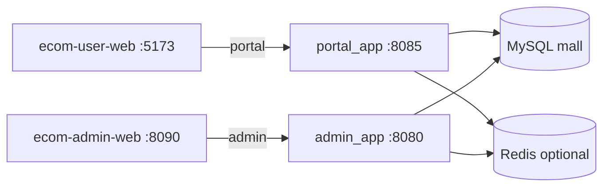

# EcomAI Intelligence Platform — Architecture v0 (Phase 1)

## Overview

Three frontends share one data model (`mall` MySQL schema) and a FastAPI backend split into two runtime apps for mall API compatibility.

| Component | Path | Port | Description |
|-----------|------|------|-------------|
| Admin API | `ecom-api` → `admin_app` | **8080** | Management APIs (`/admin`, `/product`, `/order`, …) |
| Portal API | `ecom-api` → `portal_app` | **8085** | User mall APIs (`/sso`, `/home`, `/cart`, `/order`, …) |
| Admin Web | `ecom-admin-web` | **8090** | Vue 3 + Element Plus (from `mall-admin-web-master`) |
| User Web | `ecom-user-web` | **5173** | Vue 3 PC mall |

## Module diagram



## Tech stack

- **Backend**: FastAPI, Uvicorn, SQLAlchemy, PyMySQL, python-jose, passlib
- **Frontend**: Vue 3, Vite, TypeScript, Pinia, Vue Router, Axios, Element Plus (admin)
- **Data**: MySQL 8 (`mall.sql` + `sql/ddl/ecom_event_log.sql`)
- **Cache**: Redis (optional in Phase 1; JWT is stateless)

## API contract

Single source: `docs/openapi/ecom-api.yaml`. Response envelope matches mall:

```json
{ "code": 200, "message": "操作成功", "data": {} }
```

## Phase 1 scope

- OpenAPI reviewed baseline
- Admin: login, product list, publish status, order list/detail
- Portal: login, home, product detail/search, cart, address, order create/pay/list
- No event tracking, ADS, or AI (Phase 2+)

## Default accounts (from mall.sql)

| Role | Username | Password |
|------|----------|----------|
| Admin | `admin` | `123456` |
| Member | `test` | `123456` |
